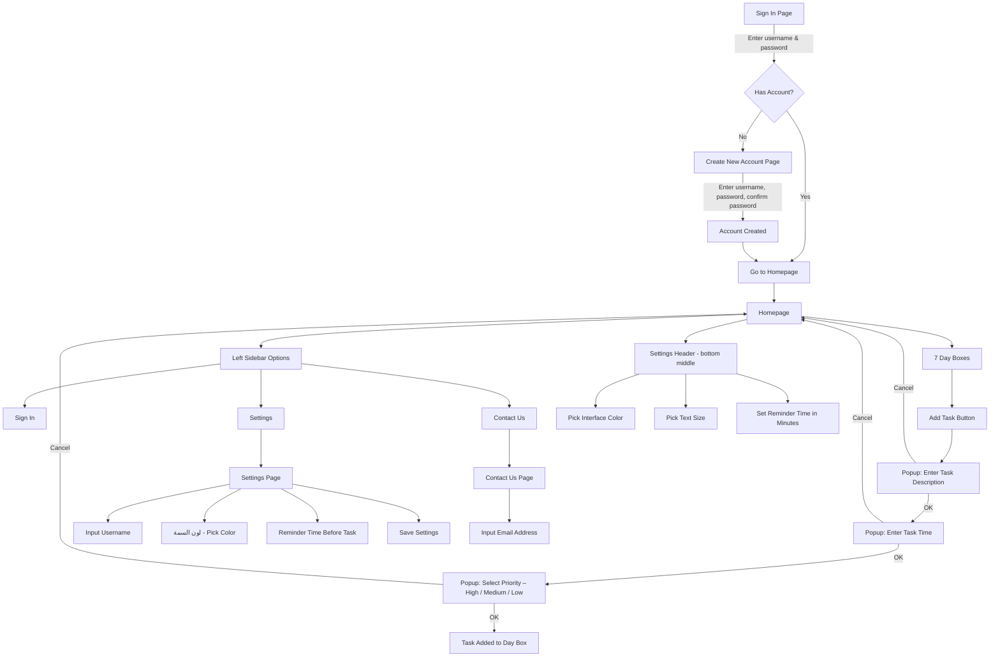

# # Dawween | دوّن

This project combines a to-do list, calendar, and AI assistant to help you stay organized effortlessly.

Smart Reminders: Get notified in advance and receive AI-generated suggestions to tackle your tasks.  
Exam/Test Support: Automatically schedules study sessions and provides study tips or resources.  
Calendar Integration: Visualize deadlines and avoid last-minute stress.  
AI-Powered Ideas: Stuck on a task? Get quick, actionable steps to make progress.  

Perfect for students, professionals, and anyone who wants to work smarter, not harder.

The flowchart below shows the basic user flow and system components of Dawween:
- User signs in or creates an account
- Navigates to homepage with weekly calendar
- Adds tasks with details and priority
- Settings and contact pages available
- Backend manages data storage and user sessions

